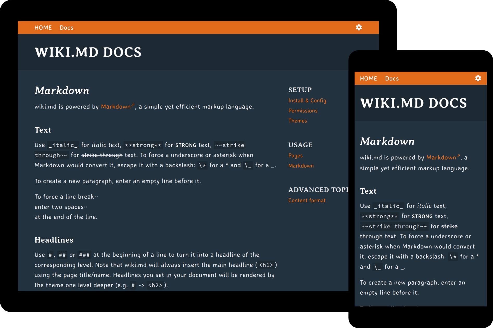

# wiki.md-theme-sunset

A wiki.md theme built around the Averia font family.



## Requirements

* [wiki.md](https://github.com/nerdreich/wiki.md) v0.5.0

## Installation

* Download a [release](https://github.com/nerdreich/wiki.md-theme-sunset/releases).

* Extract the `*.tar.gz`/`.zip` into the `themes/` folder of your wiki.md installation.

* Edit your `data/config.ini` and set the theme to `sunset`.

### Build from source

For most users the pre-packaged `*.tar.gz`/`*.zip` should be fine. If you still want to build this theme yourself, you'll need `git`, `php` v7.1+, `npm` v6.5+ and `gulp` v4. Assuming all requirements are met, just:

```
git clone --depth 1 https://github.com/nerdreich/wiki.md-theme-sunset
cd wiki.md-theme-sunset
npm install
gulp release
```

Afterwards, the archives can be found in the `dist/` folder.
